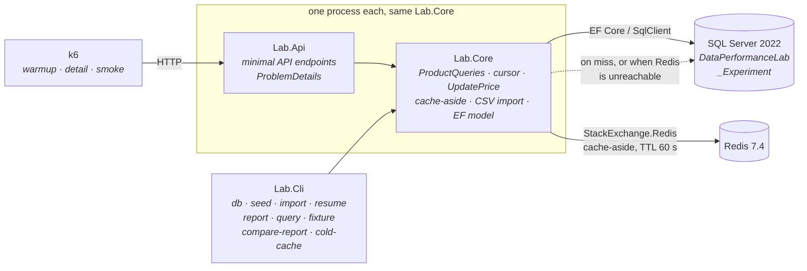

# dotnet-data-performance-lab

[](https://github.com/hidayetcolkusu/dotnet-data-performance-lab/actions/workflows/ci.yml)

> **Türkçe özet:** SQL/EF Core sorgu kararlarını, çökmeye dayanıklı CSV import'u ve Redis
> cache-aside'ı gerçek kanıtlarla ölçen yerel bir .NET 10 laboratuvarı. Her ölçüm manifest'li:
> commit, ortam, veri seti hash'i ve parametreler kayıtlı. En ilginç bulgu, cache'in bu iş
> yükünde işleri **yavaşlatması** ve bunun nedeninin ölçülmüş olması.

A local .NET 10 laboratory for making data-access decisions **measurable**, and for finding out
when the measurement disagrees with the expectation.

## The problem

"Add an index", "project in SQL" and "put Redis in front of it" are usually decided by intuition
and checked, if at all, by a load test that cannot tell a real effect from noise. This lab treats
each decision as an experiment instead. It changes exactly one factor, proves that both variants
return the same result, alternates the order of the arms, repeats the comparison, and publishes
every run with a manifest. Failed runs are published too.

The workload is a synthetic 100,000-product catalog on SQL Server 2022 and Redis 7.4. It runs
three controlled experiments and a resumable, atomic CSV import whose crash behaviour is proven
by tests.

## Key results

| Experiment | Changed factor | Result |
|---|---|---|
| **Q1 index** | covering index absent → present | **45.5 ms → 1.3 ms** (~34×); logical reads 35,218 → 6 |
| **Q2 projection** | entity materialization → SQL projection | **2.5 ms → 1.4 ms** (~1.8×) |
| **Q3 cache** | `Cache:Enabled` false → true | median run p95 **4.71 ms → 7.69 ms**: the cache made it **~1.6× slower** |

Q1 and Q2 are medians of per-round medians (5 rounds × 20 samples per variant, AB/BA). Both
variants produced an identical ordered result hash; without that, the timing comparison is
refused. Q3 is the 2026-10-04 measurement from a clean commit: 20 req/s for 60 s per run, five
repetitions alternating AB/BA, a fresh API process and cache namespace per arm.

**Why the cache lost.** The measured window's hit rate was **0.167–0.177**, so about 83% of
lookups missed. A miss costs a Redis round-trip *plus* the SQL read it was meant to avoid, and a
hit saves only an indexed single-row lookup that already takes ~2 ms. Most fixture SKUs are
requested about once in the window (1,000 SKUs at 20/s over 60 s), so there is little reuse for
a cache to exploit. A different workload could plausibly reverse the result. That workload was
not measured here.

**Why the result is credible.**

- The cache lost in **every repetition, on both the median and the p95**. The run had 0 dropped
  iterations, 0 failed requests and 0 Redis failures.
- It agrees with two earlier packages (~1.7× and ~1.9×), which were measured with older Redis
  connection code.
- The hit rate is bounded by counter snapshots taken before and after the measured run. In
  every run, the lookups in that window equal the measured GET count.
- One earlier claim did not survive. On 2026-10-04 the arms' p95 ranges **overlap** across
  repetitions, because the fifth repetition was faster for both arms. The supported claim is
  "slower in every repetition", not "non-overlapping".
- An earlier hit rate of `0.286` described warmup *and* measurement together, because the
  cumulative counters were read once after the run. It is kept with its correction and is not
  quoted as a measured-window rate.

**A run that was thrown out.** In one 2026-09-13 attempt Redis became unreachable 23 times
mid-run. That caused 133 dropped iterations, and one request took 103 seconds even though Redis
timeouts were 1 second. The harness marked the run invalid and failed the comparison instead of
averaging it in. The 103 s stall came from this repo's reconnect logic, which re-dialled Redis
under a lock and serialized requests during the outage. The fix creates the connection once and
lets it reconnect in the background. Integration tests cover both the fail-fast behaviour during
an outage and the recovery afterwards. The 2026-10-04 run above was measured on the fixed code.

An unalternated, unrepeated load test on a warm cache that only checked status codes would have
reported the opposite.

**[Full results, with what each one may and may not claim →](results/published/README.md)**

## How it fits together



Both entry points share one `Lab.Core`, so the CLI and the API cannot disagree about how a row is
read or written. The dotted edge is the whole cache contract: a miss and an unreachable Redis take
the same path to SQL, so a Redis outage degrades the API instead of failing it.

Experiment DDL never touches the database the API serves. Index experiments run against
`DataPerformanceLab_Experiment`, a separate database
([ADR 001](docs/decisions/001-measurement-boundary.md)).

### What it demonstrates

- **Keyset pagination** with a cursor bound to the query it was issued for. Replaying a cursor
  against a different category returns `400`, not a wrong page.
- **Two controlled query experiments.** They refuse to report timings unless both variants
  produce the identical ordered result, alternate AB/BA across rounds, and capture real
  execution plans and `STATISTICS IO` in a pass separate from the timed one.
- **An atomic, resumable CSV import.** The checkpoint commits in the same transaction as the
  rows it describes, so a crash cannot lose or duplicate work. A fault injector proves it.
- **Cache-aside** with a bounded stale window, counted failures and degraded-but-ready health.
  An integration test reproduces the stale-refill race the design cannot prevent.
- **A load-comparison harness.** It marks a run invalid when the run drops iterations, fails a
  check or loses an artifact, rather than averaging it in. It never pools per-run percentiles
  into a "global p95".

## Run it

```powershell
./scripts/bootstrap.ps1 -StartContainers
dotnet run --project src/Lab.Cli -- db migrate
dotnet run --project src/Lab.Cli -- seed --profile ci        # 1,000 products
dotnet run --project src/Lab.Api                             # http://127.0.0.1:8080
```

| Scenario | Command | Expected |
|---|---|---|
| List a page | `GET /api/products?categoryId=1&pageSize=5` | `200` + `nextCursor` |
| Replay that cursor on another category | `GET /api/products?categoryId=2&cursor=…` | `400` `InvalidCursor` |
| Product detail | `GET /api/products/SKU-0000000001` | `200` + `version` |
| Update a price with a stale version | `PUT /api/products/{sku}/price` | `409` `VersionConflict` |
| Redis stopped | `GET /health/ready` | `200`, `cache: "degraded"` |
| Import a file with bad rows | `dpl import --file data/samples/catalog-mixed.csv` | exit **2**, counts reconcile |
| Re-import the **same bytes** | same command again | exit **2** again: the same job id and the same stored counts, no work redone |
| Import a **different file** holding the same products | `dpl import --file <re-exported copy>` | a new job; those products are `skipped`, not re-inserted |
| Interrupted import | crash mid-batch (see below) | exit **1**, job left resumable with its job id printed |
| Resume it | `dpl resume --job-id <guid>` | continues from the SQL checkpoint; the CSV is not needed |
| Another import holds the lock | `dpl import …` | exit **3**, nothing changed |
| Query experiment | `dpl query --experiment index --category 1 --output …` | exit `0` + plans + manifest |
| Load smoke | `k6 run -e BASE_URL=… -e FIXTURE=… experiments/k6/smoke.js` | exit `0`; wrong fixture → nonzero |

`dpl` = `dotnet run --project src/Lab.Cli --`.

**Why re-importing exits 2, not 0.** A file is identified by the SHA-256 of its raw bytes.
Running the same bytes again finds the finished job and returns its *recorded* result unchanged:
same job id, same counts, same exit code. That job had rejected rows, so the exit code is still
`2`. The stored verdict is being replayed; it is not a second failure. A file with different bytes
that carries the same products is a different job, and its rows are `skipped` because the SKUs
already exist.

`./scripts/import-experiment.ps1` runs both paths end to end. It records the real exit code of
each scenario next to the report regenerated from SQL.

## Verify

```powershell
./scripts/verify.ps1
dotnet format --verify-no-changes
```

`verify.ps1` runs a locked restore, a Release build, then the whole suite: unit tests, plus
integration tests against real SQL Server and Redis containers via Testcontainers. Integration
tests **fail** rather than skip when Docker is unavailable, because a green run that touched no
database would prove nothing.

Current verified state: **185 unit + 106 integration tests** pass, and `dotnet format` is clean.
CI runs the same restore, build and tests on every push to `main` and every pull request, plus a
k6 correctness smoke. The
commit, toolchain, image digests and exact commands are in
[results/verification.md](results/verification.md).

### What a run needs

| | |
|---|---|
| .NET SDK | exactly the version pinned in `global.json` (`rollForward: disable`) |
| Docker | required: SQL Server 2022 and Redis 7.4, pinned by digest in `compose.yaml` |
| Disk | a few hundred MB for the container images; `--profile large` adds roughly 1 GB of SQL data |
| k6 | only for the cache load comparison, not for build or test |
| Network | only to pull the container images and restore packages the first time |

## Evidence

| Claim | Where it is backed |
|---|---|
| Every number above | [results/published/](results/published/README.md): one directory per run, each with a `manifest.json` (commit, dirty flag, SDK, package and image versions, dataset hash, parameters) |
| Q1/Q2 mechanism | real execution plans (`.sqlplan`), the exact SQL, `STATISTICS IO` and every timed sample |
| Q3 per-run detail | `comparison.md`, per-run k6 summaries, and the start/end/delta cache counters for each run |
| Import crash safety | `ImportRecoveryTests`, plus seven real CLI runs with their exit codes |
| Cache behaviour | `CacheBehaviorTests`, `PriceConcurrencyTests`, and a published per-test outcome table |
| Failed runs | kept and explained next to the valid ones |

[docs/evidence-map.md](docs/evidence-map.md) maps each claim to its test or artifact. Raw k6
sample streams and API logs are too large to commit. Each manifest records their SHA-256, size and
reproduce command instead.

The measurements were taken on one Windows machine. Each `manifest.json` records the exact SDK,
packages, images and container limits. Another machine will produce different latencies, so
reproduce the *protocol* and compare ratios against the manifest rather than raw milliseconds.

## Limitations

This is a **lab, not a production service**: one machine, synthetic data, no auth and no
deployment surface ([ADR 004](docs/decisions/004-local-only-scope.md)). There is no production,
capacity, multi-node or operational evidence here, and none is implied. The latency figures are
loopback HTTP with the database, the cache, the API and the load generator sharing one CPU.

The cache bounds staleness; it does not remove it
([ADR 003](docs/decisions/003-cache-consistency.md)). The index result is a read improvement whose
write cost was not measured. The Q3 result holds for this workload only. The sentences this
project cannot support are listed in the
[evidence map](docs/evidence-map.md#claims-this-project-can-never-support).

## Further reading

| | |
|---|---|
| [Runbook](docs/runbook.md) | commands, seed profiles, troubleshooting (including a busy port 1433) |
| [Experiments](docs/experiments.md) | the measurement protocol for Q1, Q2 and Q3 |
| [Published results](results/published/README.md) | every package, with its limits |
| [Evidence map](docs/evidence-map.md) | every claim, and the artifact backing it |
| [Verification](results/verification.md) | the current verified state and how it was produced |
| [Learning guide](docs/learning-guide.md) | six sessions; each breaks something on purpose |
| [Decisions](docs/decisions/) | [measurement boundary](docs/decisions/001-measurement-boundary.md) · [import semantics](docs/decisions/002-import-semantics.md) · [cache consistency](docs/decisions/003-cache-consistency.md) · [local-only scope](docs/decisions/004-local-only-scope.md) |
| [Contributing](CONTRIBUTING.md) | verification and measurement rules |
